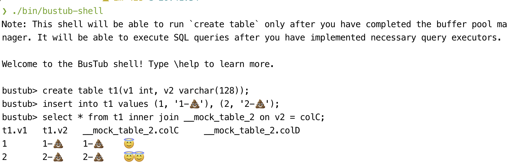

-----------------

BusTub 是一个关系型数据库管理系统，由[卡内基梅隆大学](https://db.cs.cmu.edu)为[数据库系统导论](https://15445.courses.cs.cmu.edu) (15-445/645) 课程开发。该系统用于教学目的，**不应在生产环境中使用**。

BusTub 支持基本的 SQL，并附带一个交互式 shell。在完成所有课程项目后，你可以运行它。

## 项目进展

### Project

- [x] Project #0 - C++ Primer
- [x] Project #1 - Buffer Pool Manager
- [x] Project #2 - B+ Tree Index Checkpoint 1
- [ ] Project #2 - B+ Tree Index Checkpoint 2

### Homework

- [x] Homework #1 - SQL
